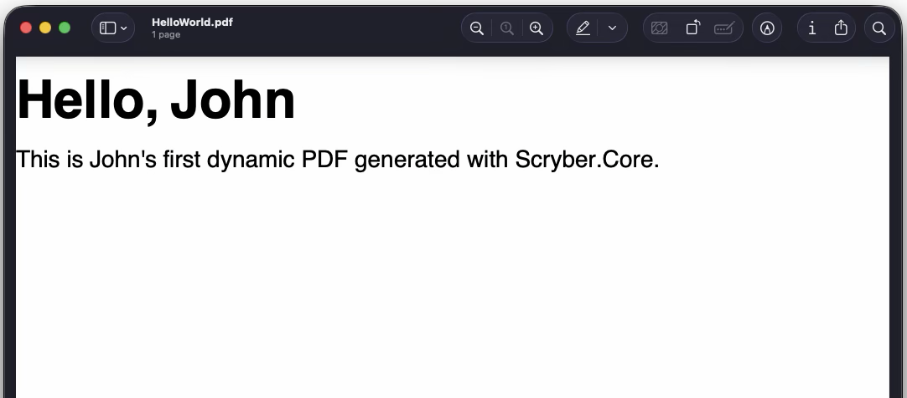

# Scyber Quick Deep Dive

If you haven't got the library set up, then if you want to follow along with this scenario we would recommed you take the [Quick Start](/quickstart/quickstart_core) steps to make sure you have everything installed and set up.

Otherwise, let's jump in...

---

## The Scenario

Just for this example, let's consider you are a mid/front-end dev in a medium to large company (And yes, you are exploring the capabilities of various libraries for report generation).

We also know that there is a big push on at the moment in HR for internal promotions, rather than agency recruitment and fees. But also, they are not getting up to date resume's from staff and they need people to complete their profile.

The genius, within us all, makes a connection - can we 

Whilst Scryber is open source and the code can be downloaded and built locally, the easiest way is to add the nuget package to a new or existing project. Consult your own IDE documentation if you are not sure how to do this, or add the package from the command line in the project folder.

```
dotnet add package Scryber.Core
```

The package is located at [https://www.nuget.org/packages/Scryber.Core](https://www.nuget.org/packages/Scryber.Core)

If you are focussed on MVC or Web development, then you can use the Scryber.Code.Mvc package, the adds helpers and extra support for sending PDF's as responses to requests, and other capabilites. It also includes a reference to the matching Scryber.Core package.

```
dotnet add package Scryber.Core.Mvc
```

The package is located at [https://www.nuget.org/packages/Scryber.Core.Mvc](https://www.nuget.org/packages/Scryber.Core.Mvc)

---

## Create a template file

The first thing we can do is add a simple html template file (the ubiquitous Hello World) as a starter and call the file 'Hello.html'.

#### Hello.html
```handlebars
<html xmlns='http://www.w3.org/1999/xhtml'>
<head>
    <!-- Give it a title -->
    <title>Hello World</title>
</head>
<!-- dynamic styling -->
<body>
    <!-- A heading title -->
    <h1>Hello World</h1>

    <!-- custom style support -->
    <p class='intro'>
      This is my first dynamic PDF generated with Scryber.Core.
    </p>
</body>
</html>
```

Save the file, and we can start to generate our first PDF.

{: .note }
> Scyber will accept streams, text readers and xml readers so you can load from many different sources (or resources), but for this example it  makes sense to use a file (it doesn't even need to have the '.html' extension, use '.config', and it will never be sent over a web server).

---


## Generate our first template


At an approprite location within your code, either responding to an event firing, or web request add the following

#### PDF Generation
```csharp
        //using Scryber.Components

        var input = "hello.html"; //Load the HTML template from a file (or open stream, or text reader)
        using var doc = Document.ParseDocument(input); //read the template

        using var output = new FileStream("hello.pdf", FileMode.Create); //create the stream to write to.
        doc.SaveAsPDF(stream); //write the pdf file.

```

---

## Viewing the result

The resultant file should now be able to be opened in any PDF Viewer application or browser, and should look like this.


---

## Making it dynamic

In the original template you may have noticed a few `{{handlebar}}` expressions such as `{{user.firstName ?? "World"}}` within the template. Scryber is using these to evaluate at runtime values provided to the document instance. The `??` is a [Null Coalescing](reference/binding/operators/nullcoalesce) operator that will provide the second value `"World"` if the first - the `user.firstName` object property reference - is null. 

With scryber we can now easily provide the dynamic data to the document using its `Params` property.


#### Add our user
```csharp
        var input = "hello.html";
        using var doc = Document.ParseDocument(input);

        //set the user to an instance (or JSON) value
        doc.Params["user"] = new { firstName = "John", lastName = "Smith" };

        using var output = new FileStream("hello.pdf", FileMode.Create);
        doc.SaveAsPDF(stream);

```

---

## Checking the result

If we generate again, our World should now be John, and I know he appreicates that!



---

## Getting More Advanced

This is a very simple example, as all Hello Worlds should be!

If it didn't work for you, look for errors and try the more detailed [getting started](/learning/01-getting-started/) section, that coveres different options and a more detailed introduction.

If it did, and you want to explore the features quickly - Take it to the next level and see what can actually be done with a [Quick start deep dive](/quickstart/quickstart_deepdive) walkthrough. (It's worth it!)

---
