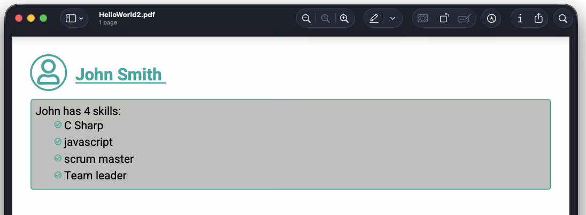

# Scyber Quick Start
{: .no_toc}

Follow along if you want to understand some of the key features and benefits of the Scryber.Core library. Here we add the package and build out a data template with dynamic styling and some repeating content. Based on your knowledge level you may then want to dive straight into your own use-cases to complete, or review the reference section to understand supported features.

---

<details class='top-toc' markdown="block">
  <summary>
    On this page
  </summary>
  {: .text-delta }
- TOC
{: toc}
</details>

---

## Application Type

If you don't have an existing application, or platform you want to add the Scryber.Core engine to, then create a new console appliction.

Scryber can be run and loaded from executables in all platforms that run dotnet, including client side Blazor WASM, but in this example we will not cover the outer execution.

Consult your own IDE documentation if you are not sure how to do this, or follow the [Learning Guides](/learning/) articles.

---

## Adding Scryber.Core

Whilst Scryber is open source and the code can be downloaded and built locally, the easiest way is to add the nuget package to a new or existing project. Or add the package from the command line in the project folder.

```
dotnet add package Scryber.Core
```

The package is located at [https://www.nuget.org/packages/Scryber.Core](https://www.nuget.org/packages/Scryber.Core)

If you are focussed on MVC or Web development, then you can use the Scryber.Code.Mvc package, the adds helpers and extra support for sending PDF's as responses to requests, and other capabilites. It also includes a reference to the matching Scryber.Core package.

```
dotnet add package Scryber.Core.Mvc
```

The package is located at [https://www.nuget.org/packages/Scryber.Core.Mvc](https://www.nuget.org/packages/Scryber.Core.Mvc)

---

## Create a template file

The first thing we can do is add a simple html template file (the ubiquitous Hello World) as a starter and call the file 'Hello.html'.

#### Hello.html
{: .no_toc}
```handlebars
<!-- the namespace is important  -->
<html xmlns='http://www.w3.org/1999/xhtml'>
<head>
    <!-- Give it a title -->
    <title>Hello World</title>
</head>
<!-- a bit of styling -->
<body style='margin: 20pt'>
    <!-- A heading title -->
    <h1>Hello, World</h1>

    <!-- custom style support -->
    <p class='intro'>
      This is my first dynamic PDF generated with Scryber.Core.
    </p>
</body>
</html>
```

Save the file in your project, and we can move on to generate our first PDF in code.

---


## Generate our first template


At an approprite location within your code, in the main function, or either responding to an event firing, or web request add the following

#### PDF Generation
{: .no_toc}
```csharp
        //using Scryber.Components

        //Load the XHTML template from a file wherever you saved it (or open stream, or text reader)
        var input = "hello.html"; 
        using var doc = Document.ParseDocument(input);

        //this is your opportunity to alter ANYTHING you want in the template

        //create a stream to write to - in this case a file.
        using var output = new FileStream("hello.pdf", FileMode.Create);
        doc.SaveAsPDF(stream); //write the pdf file.

```

---

## Viewing the result

The resultant file should now be able to be opened in any PDF Viewer application or browser, and should look like this.


---

## Troubleshooting

If it didn't work at all, then check the package and the template structure (it needs to be valid xml and include the namespace).

If it did work, but doesn't look like it should then you can check the logs with what SCryber is doing, using the `doc.AppendTraceLog = true` after parsing. Any errors that occur should appear within pages appended to the output.


---

## Making it dynamic

This is fine, but not exactly dynamic! We can add a little more 'pizzazz' with some data. We can do anything we want between parsing, setting content, adding components (tables, lists, sections etc), updating styles and much more.

But - one of the core principals of **scryber** is a clear *separation of data*, to layout and style. So we can add an object to the document parameters. This can be accessed by the template during document processing.

#### Add our user
{: .no_toc}
```csharp
        var input = "hello.html";
        using var doc = Document.ParseDocument(input);

        //set the 'user' to an instance value
        doc.Params["user"] = new { firstName = "John", lastName = "Smith" };

        using var output = new FileStream("hello.pdf", FileMode.Create);
        doc.SaveAsPDF(stream);

```
---

### Content binding syntax

The template databinding syntax is based on `{{handlebars}}`, which can appear in the content, or within attribute values. 

```html
<h1>Hello {{user.firstName}}</h1>
```

The library supports the standard 'dot' notation to access inner values (along with indexors '[]' for arrays and dictionarys).

---

### Personalize the template

So we can update our template to use this data within the content.

#### Adding expressions
{: .no_toc}
```handlebars
<html xmlns='http://www.w3.org/1999/xhtml'>
<head>
    <!-- Give it a title using the value if it is available -->
    <title>Hello {{user.firstName ?? "World"}}</title>
</head>
<body style="margin: 20pt;">
<!-- complex expression with function support -->
<h1>Hello, {{concat(user.firstName, " ", user.lastName) ?? "World"}}</h1>

<p class='intro'>
    This is {{(user.firstName + "'s") ?? "my"}} first dynamic PDF generated with Scryber.Core.
</p>
</body>
</html>
```

---

### With dynamic content

Generating the output we should have custom values placed **naturally** within the document.


---

## Style binding syntax

Along with content, the template styles can be 'bound' to dynamic values using the well known `var()` and `calc()` functions.

```html
<h1 style='color: var(brand.mainColor, black)'>Hello {{concat(user.firstName, " ", user.lastName)}}</h1>
```

And these can either be used directly, or indirectly through css variables, within the template styles, or referenced stylesheets.

```html
<style>
    :root{
        --brand-bg : var(brand.lightColor, transparent);
    }

    .branded{
        background-color : var(--brand-bg);
        color: var(brand.mainColor);
    }
</style>
```

---

## Looping through content.

The library also uses the standard `{{#each items}}` and `{{#if test}}` expressions for loops and decisions.
The current item within the loop can be accessed using the `this` reference. 

```html
{{#if count(container.items) > 0 }}
{{#each container.items}}<span class='item'>{{this.property}}</span><{{/each}}>
{{/if }}
```

---

## Extending our sample

If we add more data to our user, with some skils, and also add some custom branding.

#### Add our user
```csharp
        var input = "hello.html";
        using var doc = Document.ParseDocument(input);

        //set the user to an instance (or JSON) value
        doc.Params["user"] = new { firstName = "John", lastName = "Smith", emailAddress = "j.smith@company.com",
                                   skills = new[] {"C Sharp", "javascript", "scrum master", "Team leader"},
                                   profilePicture = "" };

        //add some custom style information.
        doc.Params["brand"] = new { mainColor = "rgb(0,168,161)", lightColor = "silver"};

        using var output = new FileStream("hello.pdf", FileMode.Create);
        doc.SaveAsPDF(stream);

```
---

## Update the template

We can now make some changes to our template and use the provided data to create a more useful template. Including:

- an external stylesheet for 'font-awesome'
- adding google fonts for 'Roboto'
- define custom css varialbles
- add a decision for a dynamic image or an icon.
- add a collection function to count items
- include a list of items if present
- add a fallback 


```handlebars
<html xmlns='http://www.w3.org/1999/xhtml'>
<head>
    <!-- Give it a title -->
    <title>Hello {{concat(user.firstName, " ", user.lastName) ?? "World"}}</title>
    <!-- Add some remote fonts from google -->
    <link href="https://fonts.googleapis.com/css2?family=Roboto:ital,wght@0,100..900;1,100..900&amp;display=swap" rel="stylesheet" />
    <!-- Load some icons from font-awesome -->
    <link rel='stylesheet' href='https://cdnjs.cloudflare.com/ajax/libs/font-awesome/5.5.0/css/all.css' />

    <style>
        /* define some css variables based on the properties, but with a fallback default */
        :root{
            --brand-color: var(brand.mainColor, red);
            --brand-bg: var(brand.lightColor, #faa);
        }

        /* Add remote fonts as the base font with fallback */
        body{
            font-family: 'Roboto', Arial, Helvetica, sans-serif;
            margin: 20pt;
            color: black;
        }

        /* classes with custom styling from the properties */
        .title{
            font-size: 18pt;
            color: var(--brand-color);
            margin-bottom: 1rem;
        }
        
        .intro{
            font-size: 12pt;
            border: solid 1pt var(--brand-color);
            padding: 5pt;
            border-radius: 2.5pt;
            background-color: var(--brand-bg);
        }

        .intro ul{
            list-style: none;
            margin: 0;
            padding-left: 20pt;
        }

        .intro ul li{
            line-height: 1.5;
        }

        .intro i.far {
            font-size: 80%;
            color: var(--brand-color)
        }

        /* floating profile picture with some spacing */
        .profile-picture{
            width: 50px;
            height: 50px;
            border-radius: 25px;
            object-fit: cover;
            float: left;
            margin-right: 10pt;
            border: solid 2pt var(--brand-color);
        }

        div.profile-picture{
            font-size: 36px;
            overflow:visible;
            color: var(--brand-color);
        }

        div.profile-picture i{
            display: inline-block;
            overflow: visible;
            padding-left: 7pt;
            padding-top: 4pt;
            vertical-align: bottom;
        }
</style>
</head>

<body>
<!-- Only include the picture if it exists -->
 {{#if (length(user.profilePicture) > 0) }}
    
{{else}}
    <!-- fall back to an icon -->
    <div class="profile-picture"><i class='far fa-user'></i></div>
 {{/if}}

 <!-- make the name a clickable email link -->
<h1 class="title">
    <a href="mailto:{{user.emailAddress}}" style="color: var(--brand-color);">
        {{concat(user.firstName, " ", user.lastName) ?? "World"}}
    </a></h1>

<!-- if we have skills, loop through them skills with a count at the start -->
{{#if count(user.skills)}}
<div class='intro'>
    {{user.firstName}} has {{count(user.skills)}} skills:
    <ul>
        {{#each user.skills}}
            <!-- a list of skills  with a check icon -->
            <li><i class="far fa-check-circle"></i> {{this}}</li>
        {{/each}}
    </ul>
</div>
{{else}}
    <!-- Fallback to no skills -->
    <div><em>{{user.fistName}} has no known skills</em></div>
{{/if}}
</body>
</html>
```

## Checking the result

Hopefully you are able re-generate and see the following output.



We have added a lot into the template - looping, images, links, styles, functions, positioning, remote fonts and stylesheets.
But the static styles can be moved to a separate linked file, and the actual body is only about 20 lines long, and quite readable.

---

## What's next

This has been a quick dive into the capabilities of the core engine. There is still a lot that is possible!

- [Data binding functions](/learning/02-data-binding/) and the [reference](/reference/binding) listing

- Dynamic [SVG drawings and charts](/learning/06-content/02_svg_basics/) and the [reference](/reference/svgelements) contents.

- [Typography and fonts](/learning/05-typography/) for using the standard fonts, and including [custom fonts](/reference/cssselectors/selectors/css_font_face_rule).

- [Tables](/learning/04-layout/06_tables) and [Lists](/learning/06-content/04_lists) in pages with binding.

- Updating and modifying existing PDF's using [Framesets and Frames](/reference/htmltags/elements/html_frameset_frame_element)

- [Page sizes](/learning/04-layout/01_page_sizes_orientation) and column layout.

- [Embedding content and Attachments](/learning/06-content/07_attachments_embedded) in files.

- Complete CSS property support [reference](/reference/cssproperties)

- Security, permissions and document meta-data [output](/learning/07-configuration/)

- [Logging](/learning/07-configuration/02_logging) and Tracing output.

---

**Or just jump into the [Learning Guides](/learning/) to take you through each feature in turn.**


